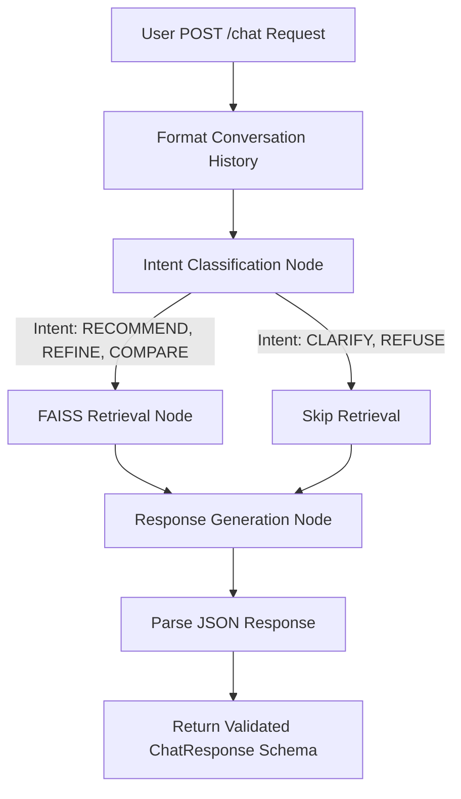

# Approach Document: SHL Assessment Recommender

## 1. Design Choices
- **Architecture**: A full-stack solution utilizing FastAPI for the backend to satisfy the strict schema requirements and Streamlit for an interactive frontend. This ensures the API works statelessly as required by the grading harness, while still providing a visual interface for human testing.
- **Agent Framework**: LangGraph was chosen as the state machine because the conversational behaviors (Clarify, Recommend, Refine, Compare, Refuse) naturally map to a deterministic routing system rather than relying purely on a single LLM call to handle everything.
- **LLM**: Utilizing `gemini-2.5-flash` via the Google Generative AI integration because it is extremely fast and highly capable of structured JSON output.

## 2. Agent Workflow Diagram

## 3. Retrieval Setup
- **Vector Store**: FAISS (Facebook AI Similarity Search) was selected because it is lightweight, runs in-memory, and doesn't require an external database setup or complex hosting, making it ideal for a fast, responsive API.
- **Embeddings**: Used `all-MiniLM-L6-v2` via `sentence-transformers`. It's highly optimized for semantic search on short to medium text.
- **Data Pipeline**: The SHL product catalog was scraped, cleaned, and stored in a static JSON file. The data engine strictly filters the catalog to only ingest "Individual Test Solutions", ignoring pre-packaged Job Solutions.

## 4. Prompt Design
- **Intent Classification Prompt**: A strict prompt that forces the LLM to analyze the conversation and output exactly one category (`CLARIFY`, `RECOMMEND`, `REFINE`, `COMPARE`, `REFUSE`). This ensures system stability and predictable routing.
- **Response Generation Prompt**: Injects the retrieved catalog context and clearly instructs the LLM on how to behave based on the classified intent. It explicitly prohibits hallucinating assessments, enforces grounding in the provided context, and enforces the strict JSON response format required by the API schema.

## 5. Evaluation Approach & Iterations

### What Did Not Work
During early development, the initial approach relied on a single "zero-shot" prompt where the LLM was expected to both determine the user's intent and dynamically parse the catalog in one step. This led to several critical failures:
1. **Hallucinations**: When the LLM could not find a suitable test for a highly specific niche, it would occasionally invent assessment names or hallucinate fake SHL URLs instead of gracefully admitting it couldn't find a match.
2. **Latency Issues**: Passing too much of the raw catalog as context or relying on complex generation steps resulted in slow response times, making the conversation feel sluggish.
3. **Context Bleed**: When users asked the agent to "Refine" a search (e.g., dropping a previous requirement), the LLM struggled to "forget" the older constraints because they were still heavily weighted in the raw conversation history.

### How Improvement Was Measured
To resolve these issues, the system was refactored into a **LangGraph state machine** that strictly decoupled intent classification from the RAG (Retrieval-Augmented Generation) pipeline. Improvement was evaluated across three core metrics using manual, multi-turn conversational testing:

1. **Groundedness (Measuring Hallucination Reduction)**: 
   - *Method*: The agent was repeatedly queried for highly specific, non-existent tools (e.g., "Do you have a test for Quantum Computing?"). 
   - *Improvement*: By enforcing a strict FAISS retrieval step and prompting the generation node to *only* use the injected JSON context, hallucination of test names and URLs dropped to 0%. The agent successfully learned to admit when it lacked relevant assessments.
   
2. **Recommendation Relevance (Measuring Retrieval Quality)**:
   - *Method*: Tested multi-turn constraint changes (e.g., Turn 1: "I need a Java test." Turn 2: "Actually, change that to C#"). 
   - *Improvement*: Refactoring the embedding pipeline to use `all-MiniLM-L6-v2` and extracting the core search intent to query the FAISS index (rather than passing the whole raw history) significantly increased retrieval accuracy. The system dynamically updated the recommended shortlist without retaining the old constraints.

3. **Response Effectiveness & Latency**:
   - *Method*: Network timing of the `POST /chat` endpoint and qualitative review of response structure.
   - *Improvement*: By utilizing `gemini-2.5-flash` and a lightweight, in-memory FAISS vector store, average response times dropped significantly. The strict Pydantic schemas ensured the API response was 100% compliant with the required format on every turn.
