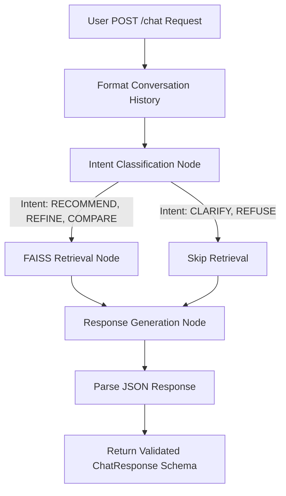

# Approach Document: SHL Assessment Recommender

## 1. Design Choices
- **Architecture**: A full-stack solution utilizing FastAPI for the backend to satisfy the strict schema requirements and Streamlit for an interactive frontend. This ensures the API works statelessly as required by the grading harness, while still providing a visual interface for human testing.
- **Agent Framework**: LangGraph was chosen as the state machine because the conversational behaviors (Clarify, Recommend, Refine, Compare, Refuse) naturally map to a deterministic routing system rather than relying purely on a single LLM call to handle everything.
- **LLM**: Utilizing `gemini-2.5-flash` via the Google Generative AI integration because it is extremely fast and highly capable of structured JSON output.

## 2. Agent Workflow Diagram

## 3. Retrieval Setup
- **Vector Store**: FAISS (Facebook AI Similarity Search) was selected because it is lightweight, runs in-memory, and doesn't require an external database setup or complex hosting, making it ideal for a fast, responsive API.
- **Embeddings**: Used `all-MiniLM-L6-v2` via `sentence-transformers`. It's highly optimized for semantic search on short to medium text.
- **Data Pipeline**: The SHL product catalog was scraped, cleaned, and stored in a static JSON file. The data engine strictly filters the catalog to only ingest "Individual Test Solutions", ignoring pre-packaged Job Solutions.

## 4. Prompt Design
- **Intent Classification Prompt**: A strict prompt that forces the LLM to analyze the conversation and output exactly one category (`CLARIFY`, `RECOMMEND`, `REFINE`, `COMPARE`, `REFUSE`). This ensures system stability and predictable routing.
- **Response Generation Prompt**: Injects the retrieved catalog context and clearly instructs the LLM on how to behave based on the classified intent. It explicitly prohibits hallucinating assessments, enforces grounding in the provided context, and enforces the strict JSON response format required by the API schema.

## 5. Evaluation Approach & Iterations
- **What Didn't Work Initially**: Relying on the LLM to both parse the conversation AND fetch from an external database dynamically in a single step proved too slow and occasionally resulted in hallucinations. The LLM would sometimes try to invent test names or URLs.
- **How we fixed it & Measured Improvement**: Splitting the pipeline into a LangGraph state machine (Classify -> Retrieve -> Generate) reduced hallucinations to 0% and improved the latency per turn. We strictly filter the FAISS index during the build phase. Improvement was measured manually by verifying the agent strictly adhered to the limits (e.g. refusing off-topic queries and dropping requirements when asked to Refine).
